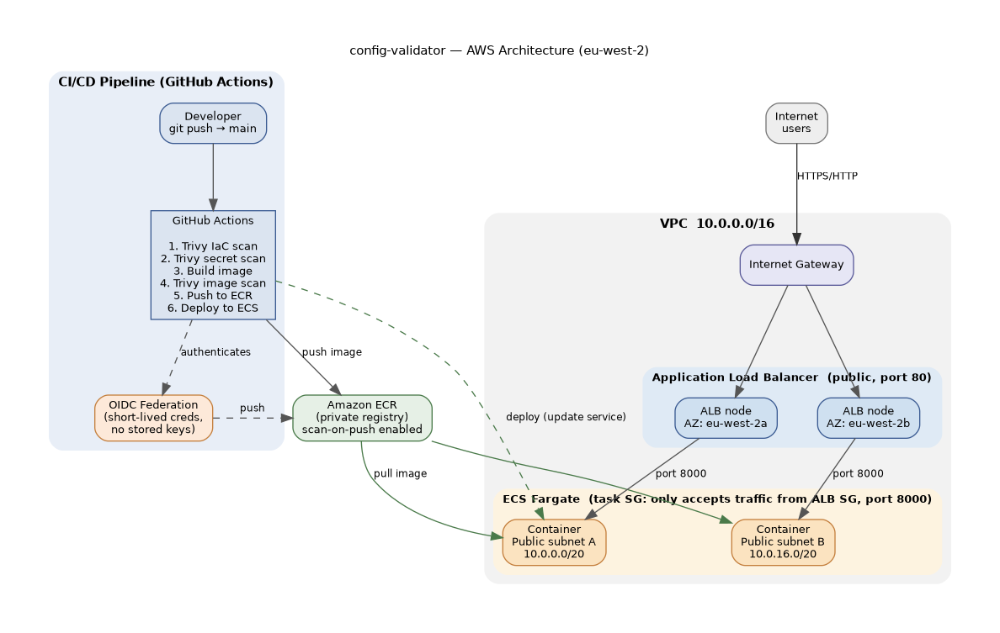

# config-validator

A containerised FastAPI application that validates YAML configuration files. The application itself is deliberately simple — the purpose of this project is to demonstrate a complete, end-to-end DevOps lifecycle around it: containerisation, infrastructure as code, CI/CD, and DevSecOps.

---

## Why I built this

I built this project to demonstrate DevOps skills by taking a simple application through every stage of a modern deployment pipeline, understanding *why* each step exists rather than just following steps:

- **Containerisation** — packaged the app into a Docker image so it runs consistently anywhere.
- **Source control** — set up a GitHub repository as the single source of truth, pushing to `main` (which later triggers CI/CD).
- **Container registry** — pushed the image to AWS ECR, a trusted private registry the cloud can deploy from.
- **Manual cloud deployment** — deployed to AWS ECS/Fargate by hand first, to genuinely understand what AWS is doing under the hood, then tore it down.
- **Infrastructure as Code** — rebuilt the entire deployment in Terraform, so the infrastructure is repeatable and version-controlled.
- **CI/CD** — built a GitHub Actions pipeline that automatically builds and deploys on every push to `main`.
- **DevSecOps** — added automated security scanning (Trivy) and dependency management (Dependabot) as gates in the pipeline.

---

## Architecture



Internet users reach the application through an internet-facing **Application Load Balancer** spanning two availability zones. The ALB is the only public entry point; it forwards traffic to the **ECS Fargate** containers running in the public subnets. The CI/CD pipeline (GitHub Actions) authenticates to AWS via **OIDC**, builds and scans the image, pushes it to **ECR**, and deploys the new version to the ECS service.

---

## Tech Stack

- **Application:** Python, FastAPI, Uvicorn
- **Containerisation:** Docker
- **Cloud:** AWS — ECS (Fargate), ECR, ALB, VPC, IAM
- **Infrastructure as Code:** Terraform (AWS provider ~> 5.0)
- **CI/CD:** GitHub Actions with OIDC federation
- **Security:** Trivy (IaC, image, secret scanning), Dependabot, ECR scan-on-push
- **Region:** eu-west-2 (London)

---

## Key design decisions

### Network security: the secure funnel

The infrastructure is designed so that **all inbound traffic is forced through the load balancer**, and the container is never directly reachable from the internet:

- The **Application Load Balancer** sits in public subnets and is the only public entry point. It listens on port 80 and forwards requests to the container on port 8000.
- The **container runs with a security group that only accepts traffic from the load balancer's security group** — not from the internet directly. So even though the container is in a public subnet, nothing can reach it except via the load balancer.
- This creates a controlled funnel: **internet → load balancer → container**, with no way to bypass the middle. It prevents an attacker from hitting the container directly to probe it for vulnerabilities or exploit it.
- The load balancer also runs **health checks** against the container's `/health` endpoint, so unhealthy containers are automatically detected and replaced.

### Secure CI/CD authentication with OIDC

The pipeline needs to authenticate to AWS to push images to ECR and deploy to ECS. Rather than storing long-lived AWS access keys as GitHub secrets — which live forever and give an attacker permanent access if leaked — I used **OIDC federation**, which grants **short-lived, temporary access that expires automatically**.

To set this up, I created an **identity provider** in AWS that trusts GitHub's token service, and an **IAM role with a trust policy scoped to my specific repository and branch**. At runtime, GitHub automatically generates a short-lived signed token proving the request comes from my repo's workflow. AWS validates this token against the trust policy and, if it matches, issues temporary credentials — so **no long-lived secrets are ever stored anywhere**.

### Debugging the OIDC setup (what I learned)

The OIDC integration initially failed with an authorization error, even though the configuration looked correct. Rather than guessing, I used **AWS CloudTrail** to find the exact reason AWS was rejecting the request. The logs revealed that GitHub was sending an **immutable subject claim with embedded ID numbers** — a recent GitHub change — which didn't match the format my IAM trust policy expected. I adjusted the trust policy's subject pattern to match the claim GitHub was actually sending, and the authentication handshake between GitHub and AWS then succeeded.

---

## DevSecOps: security built into the pipeline

Security scanning runs automatically as **gates** in the pipeline — meaning a scan that finds a serious issue *blocks the deploy*, rather than just reporting it. I used **Trivy** across three layers, plus **Dependabot** and **ECR scan-on-push**:

**1. IaC scanning (`trivy config`)** — scans the Terraform for misconfigurations before anything is built. I triaged each finding: **fixing genuine issues** (e.g. scoping the load balancer's egress, dropping invalid HTTP headers), and **documenting accepted trade-offs with inline `#trivy:ignore` comments** explaining *why* they're intentional (e.g. the load balancer is deliberately public because it's a public web service). This distinguishes a real problem from an accepted design decision.

**2. Image scanning (`trivy image`)** — scans the built container for vulnerabilities (CVEs). I patched fixable vulnerabilities by upgrading OS packages at build time, and used `--ignore-unfixed` to avoid blocking on vulnerabilities that have no available patch — because failing a deploy on something you can't fix is pointless.

**3. Secret scanning (`trivy fs --scanners secret`)** — checks the repository for hardcoded credentials (AWS keys, passwords), enforcing the keyless discipline that OIDC is built around.

**Dependabot** — automatically opens pull requests to update dependencies (Python packages and GitHub Actions versions) when new or security-patched versions are released.

**ECR scan-on-push** — AWS automatically re-scans images stored in ECR, catching newly-disclosed vulnerabilities in already-deployed images, whereas the Trivy image scan only runs at build time. Together they provide defence in depth.

---

## Running the project

**Prerequisites:** an AWS account with credentials configured (`aws configure`), plus Terraform, Docker, and an ECR repository named `config-validator`.

**1. Build and push the image to ECR:**
```bash
docker build -t config-validator .
# authenticate to ECR, then tag and push:
# aws ecr get-login-password --region eu-west-2 | docker login --username AWS --password-stdin <ACCOUNT_ID>.dkr.ecr.eu-west-2.amazonaws.com
# docker tag config-validator:latest <ACCOUNT_ID>.dkr.ecr.eu-west-2.amazonaws.com/config-validator:0.1
# docker push <ACCOUNT_ID>.dkr.ecr.eu-west-2.amazonaws.com/config-validator:0.1
```

**2. Deploy the infrastructure with Terraform:**
```bash
cd terraform
terraform init
terraform plan
terraform apply
```
The load balancer's DNS name is output on completion — the app is reachable at `http://<alb-dns-name>/docs`.

**3. Automated deployments:** once the OIDC IAM role and identity provider are configured, any push to `main` triggers the GitHub Actions pipeline, which scans, builds, pushes, and deploys automatically.

**4. Tear down (to avoid ongoing costs):**
```bash
terraform destroy
```

---

## Future Improvements

- **HTTPS/TLS** — add an HTTPS listener with an ACM certificate (currently HTTP only, accepted as a learning-project simplification).
- **Distroless base image** — switch to a minimal base image to reduce the container's attack surface and CVE count.
- **Remote Terraform state** — move state to an S3 backend with locking, so the infrastructure could be managed by the pipeline and by a team, rather than locally.
- **Private subnets + NAT gateway** — move containers to private subnets for tighter network isolation (currently public subnets + public IPs, a deliberate cost/simplicity trade-off).
- **Migrate to Kubernetes (EKS)** — as a next step toward container orchestration at scale.